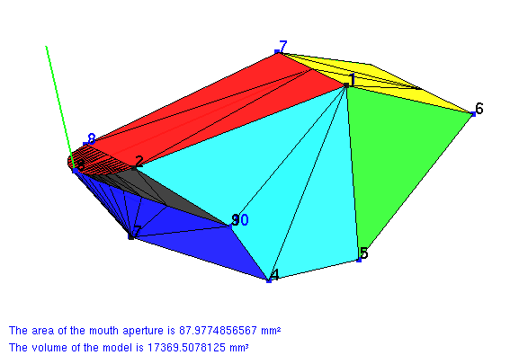

.. $Id$    -*- rst -*-

..
  This file is part of the pyFormex project.
  pyFormex is a tool for generating, manipulating and transforming 3D
  geometrical models by sequences of mathematical operations.
  Home page: http://pyformex.org
  Project page:  https://savannah.nongnu.org/projects/pyformex/
  Copyright (C) Benedict Verhegghe (benedict.verhegghe@ugent.be)
  Distributed under the GNU General Public License version 3 or later.

  This program is free software: you can redistribute it and/or modify
  it under the terms of the GNU General Public License as published by
  the Free Software Foundation, either version 3 of the License, or
  (at your option) any later version.

  This program is distributed in the hope that it will be useful,
  but WITHOUT ANY WARRANTY; without even the implied warranty of
  MERCHANTABILITY or FITNESS FOR A PARTICULAR PURPOSE.  See the
  GNU General Public License for more details.

  You should have received a copy of the GNU General Public License
  along with this program.  If not, see http://www.gnu.org/licenses/.

.. include:: <isonum.txt>
.. include:: ../defines.inc
.. include:: ../links.inc

Creating meshes
===============

Hexahedral meshing
------------------

This image shows a hexahedral mesh of an arterial bifurcation.
The script to create such meshes is included in pyFormex as of release
0.9.1 (BifMesh plugin).

.. image:: ../images/hexmesh.png
   :align: center

Evaluating the feeding performance of fish species
--------------------------------------------------

This image shows a parametric model of the head of a fish. The model can
be adjusted by giving the position of ten reference points. These can for
example be obtained from measurements on CT scans. Given kinematic data
for some points, the volume changes can be computed, and from these the feeding
performance can be evaluated. You can download the script and example input
and output files in this `suction archive file`_.

The script was created for pyFormex 0.8.6. Minor changes might be required for
later versions. You will also need python-scipy and python-gnuplot to get it
running.

.. _`suction archive file`: ../_static/suction.tar.gz

.. End
